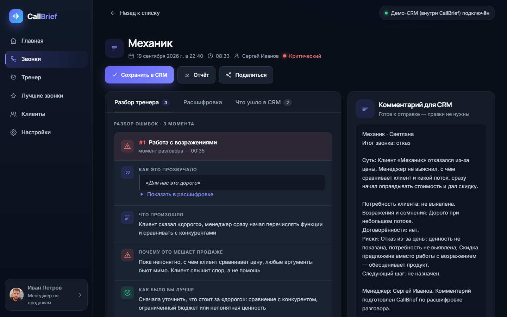
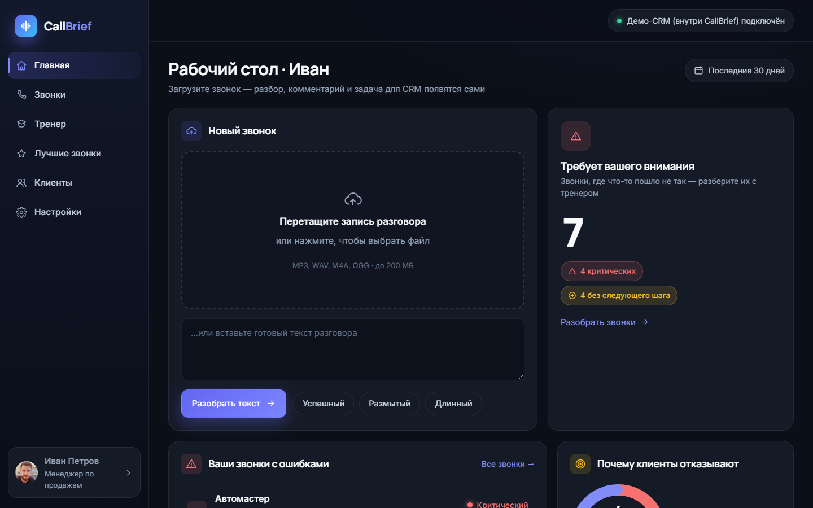
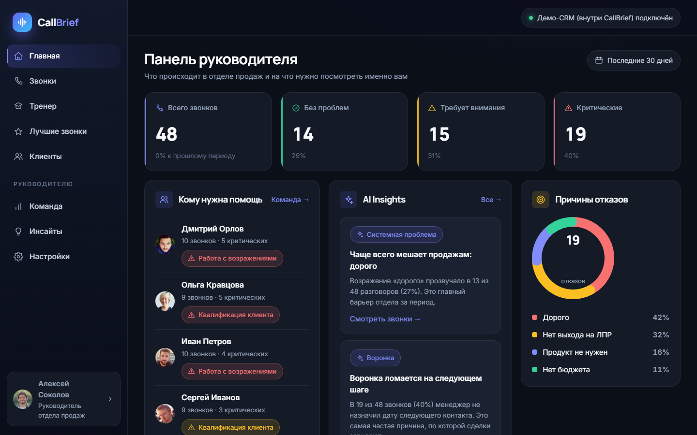
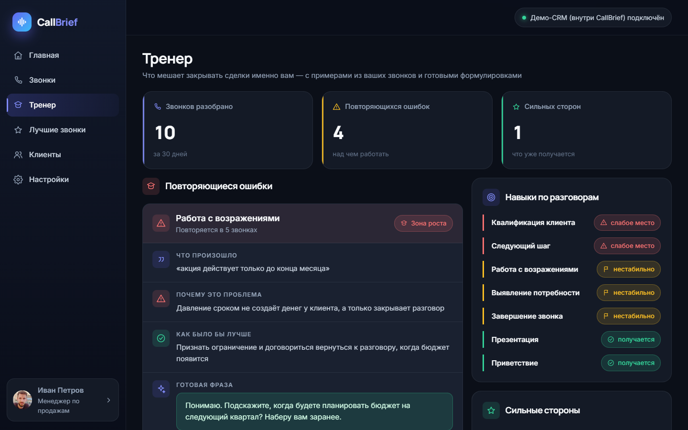
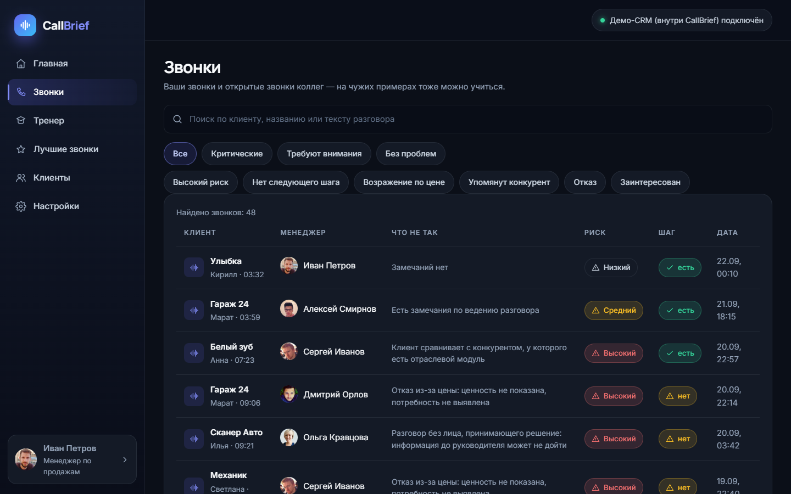

# CallBrief

**AI-разбор звонков отдела продаж.** Менеджер загружает запись разговора — через полминуты готовы расшифровка, комментарий для CRM, задача, риски сделки и разбор ошибок от AI-тренера. Одна кнопка отправляет комментарий и задачу в карточку сделки Битрикс24.

- **Менеджеру:** не тратить время на заполнение CRM и понимать, что пошло не так в каждом звонке.
- **Руководителю:** не слушать все звонки подряд, а видеть, какие требуют внимания и в чём системные проблемы отдела.



## Возможности

| | |
|---|---|
| **Расшифровка** | Аудио mp3 / wav / m4a / ogg до 200 МБ, метки времени и разметка «менеджер / клиент». Текст появляется по мере распознавания |
| **Комментарий для CRM** | Развёрнутая заметка о разговоре: с кем говорили, потребность, возражения, договорённости, следующий шаг |
| **Договорённости и риски** | Только то, что прозвучало явно. У каждого риска — совет, что с ним делать |
| **AI-тренер** | Ошибки менеджера с цитатой и таймкодом, почему это мешает продаже, как было бы лучше, готовая фраза. Повторяющиеся ошибки по всем звонкам |
| **Лучшие звонки** | Удачные формулировки коллег по навыкам — можно послушать нужный момент |
| **Панель руководителя** | Звонки по критичности, кому из менеджеров нужна помощь, причины отказов, выводы по отделу |
| **Битрикс24** | Панель прямо в карточке сделки: загрузил запись — нажал «Сохранить в CRM» — комментарий и задача уже в сделке |

Каждый вывод модели подкреплён **дословной цитатой** из разговора, и сервер проверяет, что она действительно есть в тексте.

| Рабочий стол менеджера | Панель руководителя |
|---|---|
|  |  |
| **AI-тренер** | **Список звонков с фильтрами** |
|  |  |

## Быстрый старт (Windows)

Нужен Python 3.11 или новее.

```powershell
git clone https://github.com/selena28lena/callbrief-demo.git
cd callbrief-demo
python -m venv .venv
.venv\Scripts\pip install -r requirements.txt
copy .env.example .env
.venv\Scripts\python -m uvicorn app.main:app --port 8000
```

Откройте <http://127.0.0.1:8000>. При первом запуске база заполняется **демо-отделом продаж**: 5 менеджеров, 48 разобранных звонков, вымышленные клиенты. Все разделы можно посмотреть сразу, без ключей и регистрации. Переключить роль менеджер / руководитель можно карточкой пользователя внизу слева.

Чтобы разбирать свои записи, нужен бесплатный ключ Gemini: получите его на <https://aistudio.google.com/apikey> и впишите в `.env` строкой `GEMINI_API_KEY=ваш_ключ`. Перезапускать сервер не нужно. Если Google пишет, что сервис недоступен в вашей стране, понадобится VPN.

После первой установки запускать можно двойным щелчком по `start.bat`.

## Подключение Битрикс24

1. В портале создайте входящий вебхук с правами `crm`, `task`, `user` и впишите его адрес в `.env`: `BITRIX_WEBHOOK_URL=...`. Без вебхука комментарии и задачи уходят во встроенную демо-CRM — это видно в настройках.
2. Для панели в карточке сделки Битрикс24 должен видеть приложение из интернета: нужен сервер или туннель (например, ngrok).
3. Создайте в портале локальное приложение: путь обработчика — `https://ваш-адрес/embed`, путь установки — `https://ваш-адрес/bitrix/install`, права — CRM, задачи, встраивание приложений. При первом открытии приложение само добавит вкладку CallBrief в карточку сделки.

Звонок помнит сделку, из карточки которой его загрузили, поэтому комментарий уходит именно в неё. Если запись загружена в само приложение, при сохранении откроется выбор сделки.

## Как это устроено

```
запись → расшифровка → уточнение ролей → анализ ‖ разбор тренера → проверка цитат → критичность и действия → CRM
```

Шаги с моделью выполняет Gemini (структурированный JSON по схеме), проверка цитат и критичность считаются правилами без AI. Анализ и разбор тренера идут параллельно, вся обработка — в фоне, интерфейс показывает прогресс. Подробно — [docs/ARCHITECTURE.md](docs/ARCHITECTURE.md).

**Надёжность работы с моделью.** Если основная модель перегружена (503) или упёрлась в лимит (429), запрос автоматически уходит на запасную. Оборванное соединение превращается в понятную ошибку с кнопкой повтора, а не в бесконечное ожидание.

### Проверка цитат

Модель может неточно передать слова, поэтому к каждому пункту она прикладывает дословную цитату, а сервер ищет её в исходном тексте без участия AI (`app/verify.py`):

1. Цитата и текст нормализуются: нижний регистр, `ё → е`, без пунктуации.
2. Точное совпадение по границам слов — пункт подтверждён.
3. Иначе по тексту движется окно того же размера (±20 %) и сравнивается через `difflib.SequenceMatcher`. Сходство от 0,85 прощает мелкие расхождения («подготовлю» / «подготовим»), но не пропускает выдуманные фразы.

### Разметка «менеджер / клиент»

При распознавании аудио модель различает говорящих по голосу и на телефонной записи нередко путает их. Тогда AI-тренер мог приписать менеджеру слова клиента. Поэтому после расшифровки идёт второй проход: модель заново определяет говорящего по смыслу реплик, а текст при этом не меняется. Качество разметки проверяется на контрольном наборе реплик: `python -m evals.speaker_roles`.

## Тесты

```powershell
.venv\Scripts\python -m pytest -q
```

15 тестов: проверка цитат (точная цитата, пунктуация, `ё/е`, выдуманная цитата, нечёткое совпадение) и разметка ролей (перестановка меток, разрезание слипшихся реплик). К Gemini API тесты не обращаются.

## Структура

```
app/
  main.py          приложение FastAPI, отдача страниц и статики
  api/             маршруты: звонки, аналитика, CRM, панель для Битрикс24
  services/        конвейер обработки, фоновые задачи, статистика, критичность, демо-данные
  gemini.py        промпты, вызовы модели, запасная модель, обработка ошибок
  speakers.py      уточнение ролей в расшифровке
  verify.py        проверка цитат
  crm/             адаптеры CRM: Битрикс24 и встроенная демо-CRM
  store.py, db.py  SQLite
static/            интерфейс: ES-модули без фреймворков
evals/             контрольный замер разметки ролей
tests/             pytest
docs/              архитектура и скриншоты
```

## Ограничения

- **Бесплатный тариф Gemini** ограничивает число запросов в минуту и в день. При исчерпании лимита приложение переключается на запасную модель, а если лимит исчерпан и у неё — просит подождать.
- **Разметка ролей по одному тексту** решает большинство случаев, но короткие реплики бывают неоднозначны. Надёжнее всего — запись телефонии в стерео, где менеджер и клиент в разных каналах.
- **Только обезличенные данные.** На бесплатном тарифе Google может использовать запросы для улучшения моделей. Не загружайте записи с персональными данными клиентов без их согласия.
- Вход без паролей: пользователь выбирается в интерфейсе. Для реального внедрения нужна авторизация.
