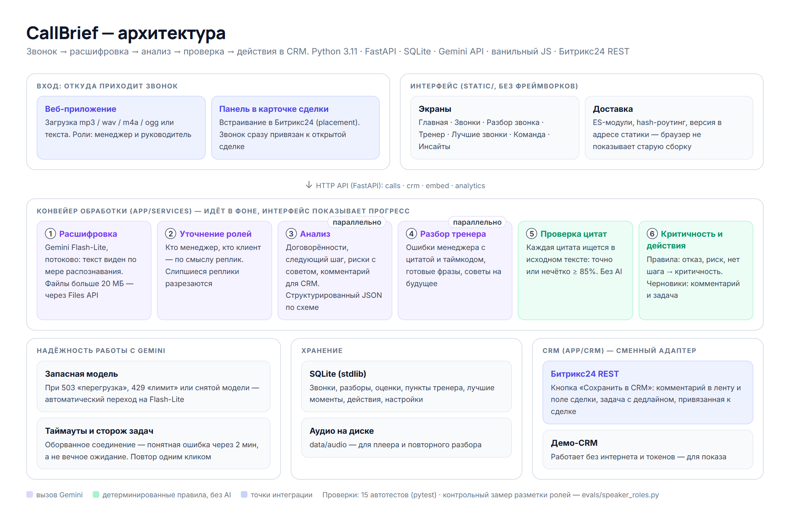
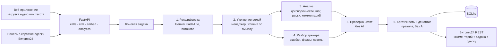

# Архитектура CallBrief

## Конвейер обработки звонка

| Шаг | Что делает | Где |
|---|---|---|
| 1. Расшифровка | Gemini Flash-Lite, потоково; файлы больше 20 МБ — через Files API | `app/gemini.py` |
| 2. Уточнение ролей | Кто менеджер, кто клиент — по смыслу реплик, а не по голосу | `app/speakers.py` |
| 3. Анализ | Договорённости, следующий шаг, риски с советом, комментарий для CRM — JSON по схеме | `app/gemini.py`, `app/schemas.py` |
| 4. Разбор тренера | Ошибки менеджера с цитатой и таймкодом; идёт параллельно с анализом | `app/services/pipeline.py` |
| 5. Проверка цитат | Каждая цитата ищется в исходном тексте: точно или нечётко от 85% | `app/verify.py` |
| 6. Критичность и действия | Правила без AI; черновики комментария и задачи для CRM | `app/services/severity.py` |

## Надёжность работы с моделью

- Запасная модель: при 503 «перегрузка», 429 «лимит» или снятой модели запрос уходит на Flash-Lite.
- Таймауты и сторож задач: оборванное соединение превращается в понятную ошибку, а не вечное ожидание.
- Сбой уточнения ролей не ломает обработку — остаётся исходная расшифровка.

## Проверки

- `pytest` — 15 тестов без обращения к API: проверка цитат, разметка ролей.
- `python -m evals.speaker_roles` — контрольный замер разметки ролей на реальной расшифровке (имя клиента скрыто).
- `python -m evals.speaker_regression` — регрессия: на 8 разговорах с верной разметкой исправление ничего не ломает.
